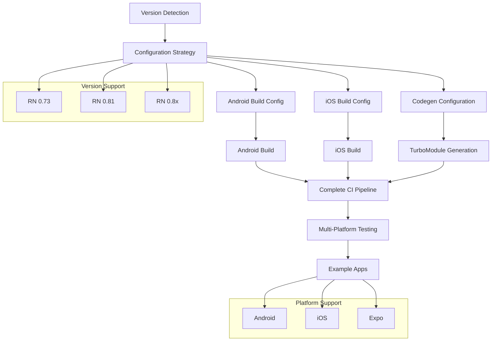
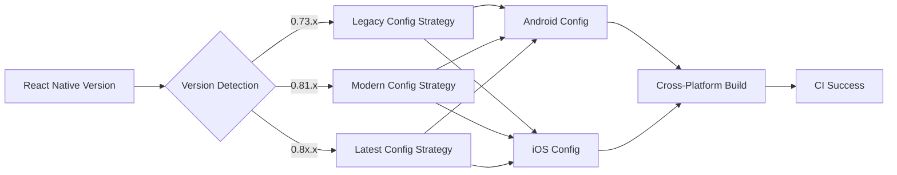

# 设计文档

## 概述

本设计文档描述了修复 React Native 项目中完整 CI 构建错误的综合解决方案。主要问题不仅包括 Android 构建中的 `codegenConfig` 配置问题，还涉及 iOS 构建配置、跨平台兼容性以及多版本示例应用的维护。

解决方案包括：
1. 修复 Android 和 iOS 构建配置以兼容不同 React Native 版本
2. 实现跨平台版本检测和自适应配置机制
3. 更新所有示例应用（Android + iOS）以支持多版本测试
4. 优化完整 CI 流水线的稳定性和性能
5. 确保 Expo 集成的跨平台兼容性

## 架构

### 整体架构图



### 跨平台配置策略架构



## 组件和接口

### 1. Cross-Platform Version Detection Module

**职责**: 检测当前 React Native 版本并选择合适的跨平台配置策略

```typescript
interface CrossPlatformVersionDetector {
  detectReactNativeVersion(): string;
  getConfigurationStrategy(version: string): CrossPlatformConfigurationStrategy;
  isVersionSupported(version: string): boolean;
  detectPlatformCapabilities(): PlatformCapabilities;
}

interface CrossPlatformConfigurationStrategy {
  getAndroidConfig(): AndroidConfig;
  getIOSConfig(): IOSConfig;
  getCodegenConfig(): CodegenConfig;
  getExpoConfig(): ExpoConfig;
}

interface PlatformCapabilities {
  android: {
    hasNewArchitecture: boolean;
    gradlePluginVersion: string;
    supportedSDKVersions: number[];
  };
  ios: {
    hasNewArchitecture: boolean;
    xcodeVersion: string;
    supportedIOSVersions: string[];
  };
  expo: {
    sdkVersion: string;
    supportsPrebuild: boolean;
    supportsNewArchitecture: boolean;
  };
}
```

### 2. Cross-Platform Configuration Manager

**职责**: 管理 Android 和 iOS 的构建配置

```typescript
interface CrossPlatformConfigurationManager {
  applyVersionSpecificConfig(version: string, platform: 'android' | 'ios' | 'both'): void;
  validateConfiguration(platform?: 'android' | 'ios'): ValidationResult;
  generateBuildFiles(platform?: 'android' | 'ios'): void;
  syncConfigurationsBetweenPlatforms(): void;
}

interface AndroidConfig {
  gradleConfig: GradleConfig;
  buildConfig: AndroidBuildConfig;
  codegenConfig: AndroidCodegenConfig;
}

interface IOSConfig {
  podspecConfig: PodspecConfig;
  buildConfig: IOSBuildConfig;
  codegenConfig: IOSCodegenConfig;
}

interface AndroidBuildConfig {
  namespace: string;
  compileSdkVersion: number;
  targetSdkVersion: number;
  minSdkVersion: number;
  gradlePluginVersion: string;
  kotlinVersion: string;
}

interface IOSBuildConfig {
  deploymentTarget: string;
  swiftVersion: string;
  xcodeVersion: string;
  fabricEnabled: boolean;
  turboModulesEnabled: boolean;
}
```

### 3. Cross-Platform Build System Adapter

**职责**: 适配 Android 和 iOS 构建系统的版本差异

```typescript
interface CrossPlatformBuildSystemAdapter {
  configureAndroidGradlePlugin(version: string): void;
  configureIOSPodspec(version: string): void;
  setupCodegenIntegration(platform: 'android' | 'ios' | 'both'): void;
  validateBuildEnvironment(platform?: 'android' | 'ios'): boolean;
  syncBuildConfigurations(): void;
}
```

### 4. Multi-Platform Example App Manager

**职责**: 管理多版本、多平台示例应用

```typescript
interface MultiPlatformExampleAppManager {
  createVersionSpecificExample(version: string, platforms: Platform[]): void;
  syncAppLogicAcrossPlatforms(): void;
  syncAppLogicAcrossVersions(): void;
  validateExampleApps(): PlatformValidationResult[];
  updateExampleDependencies(version: string): void;
}

interface PlatformValidationResult {
  platform: 'android' | 'ios' | 'expo';
  version: string;
  isValid: boolean;
  errors: string[];
  warnings: string[];
}

enum Platform {
  Android = 'android',
  iOS = 'ios',
  Expo = 'expo'
}
```

### 5. CI Pipeline Orchestrator

**职责**: 协调跨平台 CI 流水线

```typescript
interface CIPipelineOrchestrator {
  orchestrateBuilds(platforms: Platform[], versions: string[]): void;
  manageBuildMatrix(): BuildMatrix;
  handleBuildFailures(failures: BuildFailure[]): void;
  optimizeBuildOrder(): BuildStep[];
}

interface BuildMatrix {
  combinations: BuildCombination[];
  parallelGroups: BuildCombination[][];
  dependencies: BuildDependency[];
}

interface BuildCombination {
  platform: Platform;
  version: string;
  architecture: 'legacy' | 'new';
  buildType: 'debug' | 'release';
}
```

## 数据模型

### Cross-Platform Version Configuration Model

```typescript
interface CrossPlatformVersionConfiguration {
  version: string;
  android: AndroidVersionConfig;
  ios: IOSVersionConfig;
  expo: ExpoVersionConfig;
  sharedFeatures: string[];
}

interface AndroidVersionConfig {
  gradlePluginVersion: string;
  kotlinVersion: string;
  compileSdkVersion: number;
  targetSdkVersion: number;
  minSdkVersion: number;
  codegenConfigLocation: 'package.json' | 'build.gradle';
  namespace: string;
  supportedFeatures: string[];
}

interface IOSVersionConfig {
  deploymentTarget: string;
  swiftVersion: string;
  xcodeVersion: string;
  cocoapodsVersion: string;
  codegenConfigLocation: 'package.json' | 'podspec';
  supportedFeatures: string[];
}

interface ExpoVersionConfig {
  sdkVersion: string;
  supportsPrebuild: boolean;
  supportsNewArchitecture: boolean;
  configPluginVersion: string;
}
```

### Cross-Platform Build Configuration Model

```typescript
interface CrossPlatformBuildConfiguration {
  version: string;
  isNewArchitectureEnabled: boolean;
  platforms: PlatformBuildConfig[];
  sharedCodegenConfig: SharedCodegenConfig;
}

interface PlatformBuildConfig {
  platform: Platform;
  buildConfiguration: AndroidBuildConfig | IOSBuildConfig;
  platformSpecificCodegen: PlatformCodegenConfig;
}

interface SharedCodegenConfig {
  name: string;
  type: 'modules' | 'components' | 'all';
  jsSrcsDir: string;
  specFiles: string[];
}

interface PlatformCodegenConfig {
  android?: {
    javaPackageName: string;
    outputDir: string;
  };
  ios?: {
    moduleName: string;
    outputDir: string;
  };
}
```

### Multi-Platform CI Configuration Model

```typescript
interface MultiPlatformCIConfiguration {
  buildMatrix: BuildMatrix;
  cacheStrategy: CacheStrategy;
  testingStrategy: CrossPlatformTestingStrategy;
  deploymentStrategy: DeploymentStrategy;
}

interface CacheStrategy {
  gradle: boolean;
  cocoapods: boolean;
  nodeModules: boolean;
  buildArtifacts: boolean;
  cacheKeys: Record<Platform, string[]>;
}

interface CrossPlatformTestingStrategy {
  unitTests: boolean;
  integrationTests: boolean;
  e2eTests: boolean;
  platformSpecificTests: Record<Platform, TestConfig>;
}

interface TestConfig {
  enabled: boolean;
  testCommand: string;
  testEnvironment: Record<string, string>;
  requiredDevices?: string[];
}

interface DeploymentStrategy {
  artifacts: ArtifactConfig[];
  distributionChannels: DistributionChannel[];
}

interface ArtifactConfig {
  platform: Platform;
  buildType: 'debug' | 'release';
  artifactPath: string;
  uploadDestination: string;
}
```

### Example App Configuration Model

```typescript
interface ExampleAppConfiguration {
  apps: ExampleApp[];
  sharedLogic: SharedLogicConfig;
  versionMatrix: VersionMatrix;
}

interface ExampleApp {
  name: string;
  path: string;
  platforms: Platform[];
  reactNativeVersion: string;
  architecture: 'legacy' | 'new' | 'both';
  dependencies: DependencyConfig[];
}

interface SharedLogicConfig {
  coreComponents: string[];
  sharedAssets: string[];
  commonConfiguration: Record<string, any>;
}

interface VersionMatrix {
  supportedVersions: string[];
  platformCompatibility: Record<string, Platform[]>;
  featureMatrix: Record<string, Record<Platform, boolean>>;
}

interface DependencyConfig {
  name: string;
  version: string;
  platform?: Platform;
  optional: boolean;
}
```

## 正确性属性

*属性是一个特征或行为，应该在系统的所有有效执行中保持为真——本质上是关于系统应该做什么的正式声明。属性作为人类可读规范和机器可验证正确性保证之间的桥梁。*

基于对验收标准的分析和属性反思，以下是经过合并和优化的正确性属性：

### Property 1: 跨平台版本自适应配置
*对于任何* 支持的 React Native 版本（0.73, 0.81, 0.8x）和平台（Android, iOS），系统应该自动检测版本并选择对应的 Codegen 配置语法和构建工具版本
**验证需求: Requirements 1.2, 5.1, 6.1, 6.3, 7.1, 7.3**

### Property 2: 跨平台构建成功性保证
*对于任何* 有效的项目配置、支持的 React Native 版本和目标平台（Android, iOS），CI 流水线应该成功完成所有构建步骤并生成有效的构建产物
**验证需求: Requirements 1.1, 1.4, 1.5, 4.1, 4.3**

### Property 3: 跨平台架构兼容性一致性
*对于任何* 架构模式（Legacy 或 New Architecture）和平台组合，系统应该提供功能一致的构建结果，且架构切换应该自动调整所有相关的平台配置
**验证需求: Requirements 3.1, 3.2, 3.3, 3.4, 3.5, 6.4, 6.5**

### Property 4: 跨平台 Codegen 代码生成正确性
*对于任何* 有效的 TurboModule 规范文件和目标平台，Codegen 应该生成与 TypeScript 定义匹配的原生接口代码（Android Java/Kotlin, iOS Swift/Objective-C），且生成的代码应该能够正确编译和运行
**验证需求: Requirements 2.1, 2.2, 2.3, 2.4, 2.5**

### Property 5: 跨平台错误诊断和处理完整性
*对于任何* 构建错误、配置问题或依赖冲突（无论发生在 Android 还是 iOS 平台），系统应该提供具体的错误位置、原因说明和解决建议
**验证需求: Requirements 1.3, 4.2, 8.1, 8.2, 8.3, 8.4, 8.5**

### Property 6: 跨平台并行构建隔离性
*对于任何* 并行运行的构建任务（不同架构、版本或平台组合），系统应该确保构建过程相互独立且不产生干扰
**验证需求: Requirements 4.4**

### Property 7: 跨平台缓存机制有效性
*对于任何* 启用缓存的构建过程（Android Gradle, iOS CocoaPods, Node.js 依赖），系统应该有效利用缓存来提高构建速度，同时保持构建结果的正确性
**验证需求: Requirements 4.5**

### Property 8: 跨平台配置规范遵循性
*对于任何* Codegen 参数和构建选项的配置（Android 和 iOS），系统应该遵循官方文档的配置规范并使用稳定且经过验证的配置值
**验证需求: Requirements 5.2, 5.3, 5.4, 5.5**

### Property 9: 跨平台版本间 API 适配一致性
*对于任何* 新架构在不同版本间的 API 差异（Android 和 iOS），系统应该提供版本适配层来统一接口，确保团队成员使用不同版本时构建结果的一致性
**验证需求: Requirements 7.2, 7.4, 7.5**

### Property 10: 跨平台示例应用功能完整性
*对于任何* 版本和平台的示例应用（Android, iOS, Expo），系统应该保留核心功能逻辑，确保图片水印功能正常工作，并提供一致的用户体验
**验证需求: Requirements 9.1, 9.2, 9.3, 9.4, 9.5, 10.1, 10.2**

### Property 11: 跨平台示例应用架构适配性
*对于任何* 架构模式和平台组合下运行的示例应用，系统应该自动选择合适的实现（Legacy 或 TurboModule），验证库的正确集成，并在出现错误时提供清晰的调试信息
**验证需求: Requirements 10.3, 10.4, 10.5**

## 错误处理

### 跨平台错误分类和处理策略

#### 1. Android 配置错误
- **codegenConfig 属性错误**: 检测 React Native 版本，自动选择正确的配置位置（package.json 或 build.gradle）
- **版本不兼容错误**: 提供版本兼容性检查和升级建议
- **Gradle 插件版本错误**: 自动匹配 React Native 版本对应的 Gradle 插件版本
- **Android SDK 配置错误**: 验证 SDK 版本和构建工具版本
- **Kotlin 版本冲突**: 检查 Kotlin 版本与 React Native 版本的兼容性

#### 2. iOS 配置错误
- **Podspec 配置错误**: 检测 React Native 版本，自动调整 Podspec 配置语法
- **Xcode 版本不兼容**: 验证 Xcode 版本与 React Native 版本的兼容性
- **CocoaPods 版本问题**: 检查 CocoaPods 版本并提供升级建议
- **iOS 部署目标错误**: 验证 iOS 部署目标与 React Native 版本的兼容性
- **Swift 版本冲突**: 检查 Swift 版本与项目要求的兼容性

#### 3. 跨平台构建错误
- **Codegen 生成失败**: 验证规范文件格式，提供详细的错误位置信息（Android 和 iOS）
- **编译错误**: 检查生成代码的语法正确性，提供平台特定的修复建议
- **依赖冲突**: 识别冲突的依赖项和版本，区分 Android 和 iOS 依赖
- **架构不匹配**: 检测新架构和传统架构的配置冲突

#### 4. 环境错误
- **JDK 版本不匹配**: 检查 JDK 版本与 React Native 版本的兼容性（Android）
- **Xcode Command Line Tools**: 验证 Xcode 命令行工具的安装和配置（iOS）
- **Node.js 版本问题**: 检查 Node.js 版本与项目要求的兼容性
- **Python 版本问题**: 验证 Python 版本（iOS 构建依赖）

#### 5. CI 流水线错误
- **缓存失效**: 实现智能缓存策略，检测 Gradle 和 CocoaPods 缓存有效性
- **并行构建冲突**: 确保 Android 和 iOS 构建任务的隔离性和资源管理
- **工件上传失败**: 提供重试机制和备用上传策略
- **平台特定构建失败**: 区分 Android 和 iOS 构建失败的原因

#### 6. 示例应用错误
- **依赖解析失败**: 检查示例应用的依赖项与主库的兼容性
- **平台特定配置错误**: 验证 Android 和 iOS 示例应用的配置一致性
- **Expo 集成错误**: 检查 Expo 配置插件和 SDK 版本兼容性

### 跨平台错误恢复机制

```typescript
interface CrossPlatformErrorRecoveryStrategy {
  detectError(error: BuildError): ErrorType;
  suggestFix(errorType: ErrorType, platform: Platform): FixSuggestion[];
  autoRecover(error: BuildError, platform: Platform): boolean;
  syncFixAcrossPlatforms(fix: FixSuggestion): boolean;
}

interface BuildError {
  platform: Platform;
  errorType: ErrorType;
  message: string;
  stackTrace?: string;
  affectedFiles: string[];
  suggestedActions: string[];
}

interface FixSuggestion {
  platform: Platform;
  description: string;
  commands: string[];
  configChanges: ConfigChange[];
  priority: 'high' | 'medium' | 'low';
  crossPlatformImpact: boolean;
}

interface ConfigChange {
  file: string;
  changes: Record<string, any>;
  platform: Platform;
  requiresRestart: boolean;
}

enum ErrorType {
  // Android specific
  GRADLE_CONFIG_ERROR = 'gradle_config_error',
  ANDROID_SDK_ERROR = 'android_sdk_error',
  KOTLIN_VERSION_ERROR = 'kotlin_version_error',
  
  // iOS specific
  PODSPEC_ERROR = 'podspec_error',
  XCODE_VERSION_ERROR = 'xcode_version_error',
  COCOAPODS_ERROR = 'cocoapods_error',
  
  // Cross-platform
  CODEGEN_ERROR = 'codegen_error',
  VERSION_COMPATIBILITY_ERROR = 'version_compatibility_error',
  DEPENDENCY_CONFLICT = 'dependency_conflict',
  ARCHITECTURE_MISMATCH = 'architecture_mismatch',
  
  // CI specific
  CACHE_ERROR = 'cache_error',
  PARALLEL_BUILD_CONFLICT = 'parallel_build_conflict',
  ARTIFACT_UPLOAD_ERROR = 'artifact_upload_error'
}
```

## 测试策略

### 双重测试方法

本项目采用单元测试和属性测试相结合的综合测试策略：

#### 单元测试
- **特定示例测试**: 验证具体的配置场景和错误情况
- **集成点测试**: 测试不同组件之间的交互
- **边界条件测试**: 测试版本边界和配置边界情况

#### 属性测试
- **通用正确性验证**: 通过随机化输入验证通用属性
- **跨版本兼容性测试**: 验证不同 React Native 版本的一致性
- **配置组合测试**: 测试各种配置组合的有效性

### 属性测试配置

- **测试框架**: 使用 Vitest 作为主要测试框架
- **属性测试库**: 集成适合的属性测试库（如 fast-check）
- **最小迭代次数**: 每个属性测试至少运行 100 次迭代
- **测试标签格式**: `Feature: android-ci-build-fix, Property {number}: {property_text}`

### 测试覆盖范围

#### 跨平台版本兼容性测试
- React Native 0.73.x 系列（Android + iOS）
- React Native 0.81.x 系列（Android + iOS）
- React Native 0.8x.x 最新版本（Android + iOS）
- 不同 Android Gradle Plugin 版本
- 不同 Gradle 版本
- 不同 Xcode 版本
- 不同 CocoaPods 版本

#### 跨平台架构兼容性测试
- Legacy Architecture 构建（Android + iOS）
- New Architecture 构建（Android + iOS）
- 架构切换场景（跨平台同步）
- 混合架构环境

#### 跨平台 CI 环境测试
- GitHub Actions 环境
- 不同操作系统（Ubuntu for Android, macOS for iOS）
- 不同 Node.js 版本
- 不同 JDK 版本（Android）
- 不同 Xcode 版本（iOS）

#### 跨平台示例应用测试
- 基础示例应用（Legacy - Android + iOS）
- 0.73 版本示例应用（Android + iOS）
- 0.8x 版本示例应用（Android + iOS）
- Expo 示例应用（跨平台）

#### 平台特定测试
- **Android 特定**:
  - Gradle 构建配置
  - Kotlin 编译
  - Android SDK 兼容性
  - APK 生成和验证
- **iOS 特定**:
  - Podspec 配置
  - Swift 编译
  - iOS 部署目标兼容性
  - IPA 生成和验证
- **Expo 特定**:
  - 预构建 (prebuild) 功能
  - EAS Build 兼容性
  - 配置插件功能

### 跨平台测试实现要求

每个正确性属性必须通过单个属性测试实现，覆盖所有相关平台：

```typescript
test('Property 1: Cross-Platform Version Adaptive Configuration', () => {
  /**
   * Feature: android-ci-build-fix
   * Property 1: 对于任何支持的 React Native 版本和平台，系统应该自动检测版本并选择对应的配置
   * Validates: Requirements 1.2, 5.1, 6.1, 6.3, 7.1, 7.3
   */
  // 跨平台属性测试实现
  // 测试 Android 和 iOS 配置的一致性和正确性
});

test('Property 2: Cross-Platform Build Success Guarantee', () => {
  /**
   * Feature: android-ci-build-fix
   * Property 2: 对于任何有效配置和平台，CI 应该成功完成构建
   * Validates: Requirements 1.1, 1.4, 1.5, 4.1, 4.3
   */
  // 测试 Android 和 iOS 构建的成功性
});
```

### 跨平台性能基准测试

- **Android 构建时间基准**: 测量不同配置下的 Gradle 构建时间
- **iOS 构建时间基准**: 测量不同配置下的 Xcode 构建时间
- **跨平台缓存效果测试**: 验证 Gradle 和 CocoaPods 缓存机制对构建速度的影响
- **并行构建性能**: 测试 Android 和 iOS 并行构建的性能和资源使用
- **完整 CI 流水线效率**: 监控包含 Android 和 iOS 的完整 CI 流程执行时间

### 平台特定测试工具

#### Android 测试工具
- **Gradle Test Kit**: 测试 Gradle 插件和构建脚本
- **Android Emulator**: 运行集成测试
- **Espresso**: UI 自动化测试

#### iOS 测试工具
- **XCTest**: iOS 单元测试和 UI 测试
- **iOS Simulator**: 运行集成测试
- **Fastlane**: 自动化构建和测试流程

#### 跨平台测试工具
- **Detox**: React Native E2E 测试
- **Appium**: 跨平台移动应用自动化测试
- **Maestro**: 现代移动 UI 测试框架
