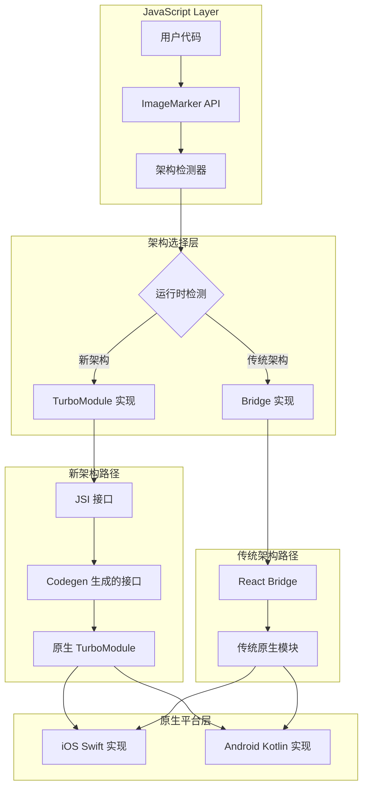

# 设计文档

## 概述

本设计文档详细描述了将 react-native-image-marker 库从传统桥接架构升级到 React Native 新架构的技术实现方案。新架构基于 TurboModules 和 Fabric，提供更好的性能、类型安全性和开发者体验，同时保持完全的向后兼容性。

升级将采用渐进式方法，确保现有用户无需修改代码即可受益于新架构的改进，同时为新架构用户提供最佳性能。

## 架构

### 整体架构设计



### 模块结构设计

```
react-native-image-marker/
├── src/
│   ├── index.ts                    # 主入口，架构检测和 API 导出
│   ├── NativeImageMarker.ts        # TurboModule 规范定义
│   ├── legacy/                     # 传统实现（保持不变）
│   └── types/                      # 共享类型定义
├── ios/
│   ├── RCTImageMarker/             # 传统 iOS 实现
│   └── ImageMarkerTurboModule/     # 新架构 iOS 实现
├── android/
│   ├── src/main/java/.../imagemarker/  # 传统 Android 实现
│   └── src/main/java/.../turbo/        # 新架构 Android 实现
└── specs/
    └── NativeImageMarker.ts        # Codegen 规范文件
```

## 组件和接口

### 1. TurboModule 规范接口

基于现有 API 设计的 TypeScript 规范，用于 Codegen 生成原生接口：

```typescript
// specs/NativeImageMarker.ts
import type { TurboModule } from 'react-native';
import { TurboModuleRegistry } from 'react-native';

export interface Spec extends TurboModule {
  markWithText(options: Object): Promise<string>;
  markWithImage(options: Object): Promise<string>;
}

export default TurboModuleRegistry.getEnforcing<Spec>('ImageMarker');
```

### 2. 架构检测器

运行时检测当前 React Native 架构并选择适当的实现：

```typescript
// src/ArchitectureDetector.ts
class ArchitectureDetector {
  private static _isNewArchitecture: boolean | null = null;
  
  static isNewArchitecture(): boolean {
    if (this._isNewArchitecture === null) {
      this._isNewArchitecture = this.detectArchitecture();
    }
    return this._isNewArchitecture;
  }
  
  private static detectArchitecture(): boolean {
    // 检测 TurboModuleRegistry 是否可用
    // 检测 JSI 是否启用
    // 检测 Fabric 是否启用
  }
}
```

### 3. 统一 API 接口

保持与现有 API 完全兼容的统一接口：

```typescript
// src/index.ts
import { ArchitectureDetector } from './ArchitectureDetector';
import TurboModuleImpl from './TurboModuleImpl';
import LegacyImpl from './legacy/LegacyImpl';

class ImageMarker {
  private static getImplementation() {
    return ArchitectureDetector.isNewArchitecture() 
      ? TurboModuleImpl 
      : LegacyImpl;
  }
  
  static markText(options: TextMarkOptions): Promise<string> {
    return this.getImplementation().markText(options);
  }
  
  static markImage(options: ImageMarkOptions): Promise<string> {
    return this.getImplementation().markImage(options);
  }
}
```

### 4. iOS TurboModule 实现

```swift
// ios/ImageMarkerTurboModule/ImageMarkerTurboModule.swift
@objc(ImageMarkerTurboModule)
class ImageMarkerTurboModule: NSObject, RCTTurboModule {
    
    @objc
    func markWithText(_ options: [AnyHashable: Any]) -> Promise<String> {
        // 复用现有的 Swift 实现逻辑
        // 通过 JSI 直接与 JavaScript 通信
    }
    
    @objc
    func markWithImage(_ options: [AnyHashable: Any]) -> Promise<String> {
        // 复用现有的 Swift 实现逻辑
    }
}
```

### 5. Android TurboModule 实现

```kotlin
// android/src/main/java/.../turbo/ImageMarkerTurboModule.kt
class ImageMarkerTurboModule(reactContext: ReactApplicationContext) 
    : NativeImageMarkerSpec(reactContext) {
    
    override fun markWithText(options: ReadableMap): Promise<String> {
        // 复用现有的 Kotlin 实现逻辑
        // 通过 JSI 直接与 JavaScript 通信
    }
    
    override fun markWithImage(options: ReadableMap): Promise<String> {
        // 复用现有的 Kotlin 实现逻辑
    }
}
```

## 数据模型

### 类型定义统一

所有现有的 TypeScript 接口保持不变，确保 API 兼容性：

```typescript
// src/types/index.ts
export interface TextMarkOptions {
  backgroundImage: ImageOptions;
  watermarkTexts: TextOptions[];
  quality?: number;
  filename?: string;
  saveFormat?: ImageFormat;
}

export interface ImageMarkOptions {
  backgroundImage: ImageOptions;
  watermarkImages: Array<WatermarkImageOptions>;
  quality?: number;
  filename?: string;
  saveFormat?: ImageFormat;
}

// 所有现有接口保持不变...
```

### Codegen 数据映射

Codegen 规范中的数据类型映射到原生平台类型：

```typescript
// specs/NativeImageMarker.ts
export interface ImageOptions {
  src: Object;           // 映射到原生图片资源
  scale?: Double;        // 映射到原生 double/CGFloat
  rotate?: Double;       // 映射到原生 double/CGFloat
  alpha?: Double;        // 映射到原生 double/CGFloat
}
```

## 正确性属性

*属性是一个特征或行为，应该在系统的所有有效执行中保持为真——本质上是关于系统应该做什么的正式声明。属性作为人类可读规范和机器可验证正确性保证之间的桥梁。*

基于预工作分析，以下是从验收标准转换而来的可测试属性：

### 属性 1: 架构检测和模块加载
*对于任何* React Native 应用环境，当检测到新架构时，系统应加载 TurboModule 实现；当检测到传统架构时，应加载桥接实现
**验证: 需求 1.1, 6.1**

### 属性 2: API 兼容性保持
*对于任何* 现有的 API 调用，新架构实现应返回与传统实现相同类型和结构的结果
**验证: 需求 1.5, 6.2, 6.4**

### 属性 3: 功能完整性
*对于任何* 传统架构支持的功能，TurboModule 实现应提供相同的功能
**验证: 需求 1.4, 4.3, 5.3**

### 属性 4: JSI 通信机制
*对于任何* TurboModule 方法调用，系统应使用 JSI 进行直接通信而不是传统桥接
**验证: 需求 1.3, 4.2, 5.2**

### 属性 5: Codegen 接口一致性
*对于任何* TypeScript 规范中定义的接口，Codegen 应生成与现有 API 完全匹配的原生接口
**验证: 需求 3.2, 3.3**

### 属性 6: 构建系统条件编译
*对于任何* 构建配置，系统应根据架构标志正确包含或排除相应的代码和依赖
**验证: 需求 7.1, 7.2, 7.3, 7.4**

### 属性 7: 异步操作处理
*对于任何* 异步图片处理操作，TurboModule 应正确处理 Promise 的解析和拒绝
**验证: 需求 4.5, 5.5**

### 属性 8: 性能改进验证
*对于任何* 图片处理操作，新架构实现应显示可测量的性能改进或至少保持相同性能
**验证: 需求 8.1, 8.2, 8.3, 8.5**

### 属性 9: 类型安全性
*对于任何* TurboModule 方法，TypeScript 编译器应能验证参数和返回值的类型正确性
**验证: 需求 1.2, 9.2**

### 属性 10: Fabric 集成兼容性
*对于任何* 图片源类型，系统应在 Fabric 和传统渲染器下都能正确处理
**验证: 需求 2.1, 2.3, 2.4**

### 属性 11: Expo 环境兼容性
*对于任何* Expo 项目配置，库应正确检测架构并与 Expo SDK 协作
**验证: 需求 10.1, 10.4, 10.5**

### 属性 12: 错误处理一致性
*对于任何* 错误情况，两种架构实现应产生相同的错误类型和消息
**验证: 需求 6.5**

## 错误处理

### 1. 架构检测失败处理

```typescript
class ArchitectureDetector {
  static detectArchitecture(): boolean {
    try {
      // 尝试检测新架构特性
      return this.hasNewArchitectureFeatures();
    } catch (error) {
      // 检测失败时默认使用传统架构
      console.warn('Architecture detection failed, falling back to legacy bridge');
      return false;
    }
  }
}
```

### 2. TurboModule 加载失败处理

```typescript
class ImageMarker {
  private static getImplementation() {
    if (ArchitectureDetector.isNewArchitecture()) {
      try {
        return TurboModuleImpl;
      } catch (error) {
        console.warn('TurboModule loading failed, falling back to legacy implementation');
        return LegacyImpl;
      }
    }
    return LegacyImpl;
  }
}
```

### 3. 原生模块错误统一处理

确保两种架构的错误消息和类型保持一致：

```typescript
class ErrorHandler {
  static normalizeError(error: any): Error {
    // 统一错误格式，确保两种架构返回相同的错误结构
    return new Error(this.extractErrorMessage(error));
  }
}
```

### 4. 构建时错误处理

在构建配置中添加错误检查：

```ruby
# react-native-image-marker.podspec
if ENV['RCT_NEW_ARCH_ENABLED'] == '1'
  # 验证新架构依赖是否可用
  begin
    s.dependency "React-Codegen"
  rescue => e
    puts "Warning: New Architecture dependencies not available: #{e.message}"
  end
end
```

## 测试策略

### 双重测试方法

**单元测试**：
- 验证特定示例和边缘情况
- 测试架构检测逻辑
- 验证错误处理路径
- 测试构建配置的正确性
- 使用 Vitest 进行传统单元测试，覆盖所有正确性属性

### 单元测试配置

每个正确性属性必须由单元测试实现：

```typescript
// __tests__/properties.test.ts
import { test, describe, beforeEach, expect, vi } from 'vitest';
import * as fs from 'fs';
import * as path from 'path';

describe('ImageMarker Properties', () => {
  test('Property 1: Architecture detection and module loading', () => {
    /**
     * Feature: react-native-new-architecture-upgrade
     * Property 1: 对于任何 React Native 应用环境，当检测到新架构时，系统应加载 TurboModule 实现
     */
    // 测试架构检测和模块加载逻辑
    const results: boolean[] = [];
    for (let i = 0; i < 5; i++) {
      results.push(ArchitectureDetector.isNewArchitecture());
    }
    
    // 验证结果一致性
    const firstResult = results[0];
    const allSame = results.every(result => result === firstResult);
    expect(allSame).toBe(true);
  });
  
  test('Property 2: API compatibility preservation', async () => {
    /**
     * Feature: react-native-new-architecture-upgrade  
     * Property 2: 对于任何现有的 API 调用，新架构实现应返回与传统实现相同类型和结构的结果
     */
    // 测试 API 兼容性
    const methods = ['markText', 'markImage'];
    methods.forEach(method => {
      expect(typeof LegacyImpl[method]).toBe('function');
      expect(typeof TurboModuleImpl[method]).toBe('function');
      expect(LegacyImpl[method].length).toBe(TurboModuleImpl[method].length);
    });
  });
});
```

### 测试环境配置

- **传统架构测试**：在禁用新架构的环境中运行
- **新架构测试**：在启用 TurboModules 和 Fabric 的环境中运行
- **Expo 测试**：在 Expo 开发构建和 EAS Build 中测试
- **性能基准测试**：比较两种架构的性能指标

### CI/CD 集成

```yaml
# .github/workflows/test.yml
strategy:
  matrix:
    architecture: [legacy, new]
    platform: [ios, android]
    expo: [managed, bare]
```

测试策略确保升级不会引入回归，同时验证新架构确实提供了预期的改进。单元测试覆盖具体场景和通用正确性，提供全面的测试覆盖。