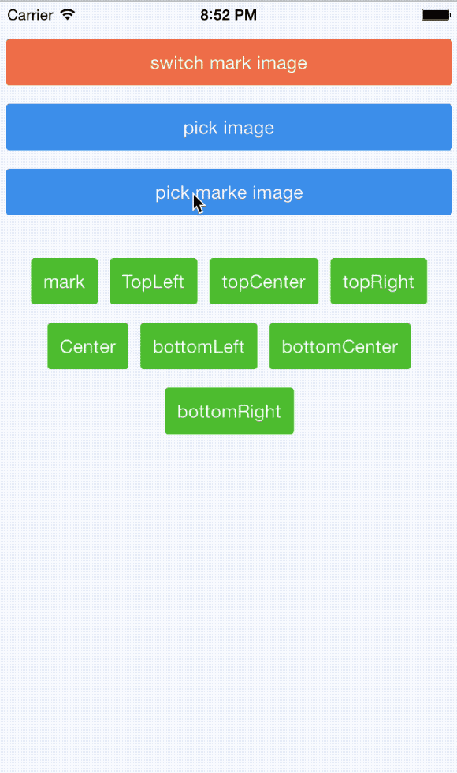
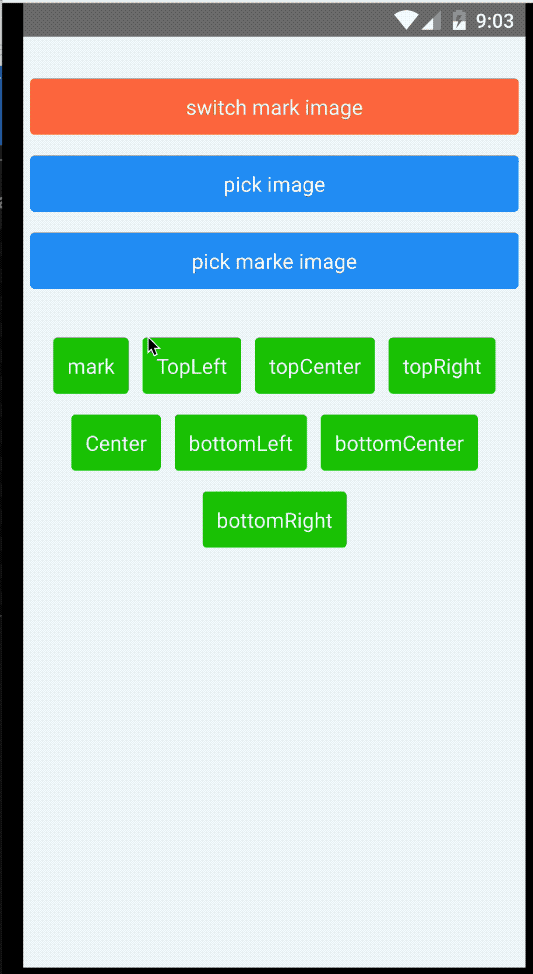
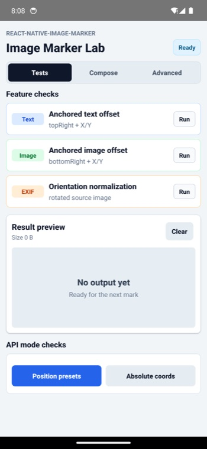
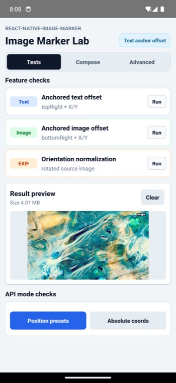
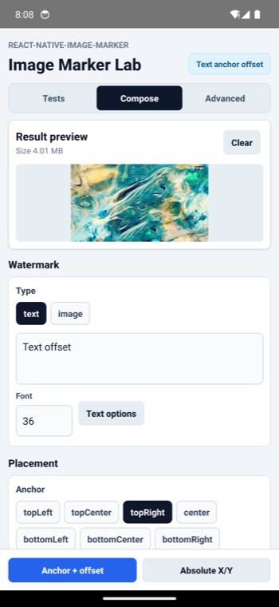
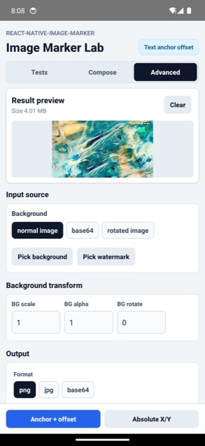

<div align="center">
    <a href="https://jimmydaddy.github.io/react-native-image-marker/" title="react native image marker">
        
    </a>
    <a href="https://jimmydaddy.github.io/react-native-image-marker/"><h1 style="color: #424E6D">react native image marker</h1></a>
    <h6>Add text or icon watermarks to images</h6>
</div>
<div align="center">

[](https://www.npmjs.com/package/react-native-image-marker)
[](https://www.npmjs.com/package/react-native-image-marker) [](https://www.npmjs.com/package/react-native-image-marker)
[](https://github.com/JimmyDaddy/react-native-image-marker) [](https://github.com/JimmyDaddy/react-native-image-marker/fork)
[](https://github.com/JimmyDaddy/react-native-image-marker/pulls) 
[](https://github.com/JimmyDaddy/react-native-image-marker)
[](https://github.com/JimmyDaddy/react-native-image-marker/actions/workflows/ci.yml)
 
<br/>

</div>

---

> - If this library is useful to you, please give me a ⭐️. 🤩
> - If there is any bug, please submit an issue 🐛, or create a pull request 🤓.
> - If there is any problem about using this library, please contact me, or [open a QA discussion](https://github.com/JimmyDaddy/react-native-image-marker/discussions/categories/q-a). 🤔

---

<!-- toc -->

## Table of Contents

- [Features](#features)
- [Installation](#installation)
  - [React Native](#react-native)
  - [Expo](#expo)
- [Compatibility](#compatibility)
- [Fonts](#fonts)

- [Common Tasks](#common-tasks)
- [Usage Guide](#usage-guide)
- [API](#api)
- [Save image to file](#save-image-to-file)
- [Contributors](#contributors)
- [Examples](#examples)
- [Contributing](#contributing)
- [License](#license)

<!-- tocstop -->

<br/>

## Features

<div>
  
  
</div>

- [**Multiple text** watermarks](https://jimmydaddy.github.io/react-native-image-marker/interfaces/TextMarkOptions.html#watermarkTexts)
- [**Multiple icon** watermarks](https://jimmydaddy.github.io/react-native-image-marker/classes/Marker.html#markImage)
- Text and icon watermarks in a single `mark` call
- [**Rotating** background and icon](https://jimmydaddy.github.io/react-native-image-marker/interfaces/ImageOptions.html#rotate)
- [Setting transparency for background and icon](https://jimmydaddy.github.io/react-native-image-marker/interfaces/ImageOptions.html#rotate)
- Base64
- Flexible text style settings, including:
  - [Rotating](https://jimmydaddy.github.io/react-native-image-marker/interfaces/TextStyle.html#rotate)
  - [Shadow](https://jimmydaddy.github.io/react-native-image-marker/interfaces/ShadowLayerStyle.html)
  - Background color
  - [Italic](https://jimmydaddy.github.io/react-native-image-marker/interfaces/TextStyle.html#italic)
  - [Bold](https://jimmydaddy.github.io/react-native-image-marker/interfaces/TextStyle.html#bold)
  - [Stroke](https://jimmydaddy.github.io/react-native-image-marker/interfaces/TextStyle.html#strikeThrough)
  - [Text align](https://jimmydaddy.github.io/react-native-image-marker/interfaces/TextStyle.html#textAlign)
  - [Padding](https://jimmydaddy.github.io/react-native-image-marker/interfaces/TextBackgroundStyle.html#padding)
  - Relative position
  - [Background border radius](https://jimmydaddy.github.io/react-native-image-marker/interfaces/TextBackgroundStyle.html#cornerRadius)
- Compatible with both Android and iOS
- React Native New Architecture support with a legacy bridge fallback
- Expo

## Installation

#### React Native

```shell
# npm
npm install react-native-image-marker --save

# yarn
yarn add react-native-image-marker
```

#### Expo

This package includes native iOS and Android code, so it does not work in Expo Go. Use a development build, `expo run:*`, or EAS Build after prebuild.

```shell
# install
npx expo install react-native-image-marker
```

Add the package plugin entry to your Expo config, matching the Expo example in this repository:

```json
{
  "expo": {
    "plugins": ["react-native-image-marker/app.plugin.js"]
  }
}
```

Then generate and build the native projects so Expo can link the native module:

```shell
npx expo prebuild

# local native builds
npx expo run:android
npx expo run:ios

# or cloud builds
eas build
```

If you add the package to an existing Expo project, rebuild the native app after `prebuild`; reloading Expo Go or Metro is not enough for native modules.

## Compatibility

| React Native Version                                 | react-native-image-marker Version |
| ---------------------------------------------------- | --------------------------------- |
| >= 0.73.0, other cases                               | v1.2.0 or later                   |
| 0.60.0 <= rn version < 0.73.0                        | v1.1.x                            |
| >= 0.60.0, **_iOS < 13, Android < N(API Level 24)_** | v1.0.x                            |
| < 0.60.0                                             | v0.5.2 or earlier                 |

> **_Note: This table is only applicable to major versions of react-native-image-marker. Patch versions should be backwards compatible._**

### New Architecture

`react-native-image-marker` supports React Native's New Architecture in v1.3.0 and later. New Architecture apps use the generated TurboModule binding, while legacy bridge apps continue to use the existing `NativeModules.ImageMarker` fallback.

To verify the runtime path locally, open the example app and check the **Architecture status** panel:

- **New architecture** means both runtime signals are available.
- **TurboModule on** means React Native exposed `global.__turboModuleProxy`.
- **Fabric renderer on** means React Native exposed `global.nativeFabricUIManager`.
- **Bridgeless off** is acceptable; it is a separate runtime mode and does not mean the New Architecture build failed.

For local New Architecture smoke tests, run the example with the platform New Architecture flags enabled:

```shell
# Android
cd example/android
./gradlew -PnewArchEnabled=true installDebug

# iOS
cd example
RCT_NEW_ARCH_ENABLED=1 NO_FLIPPER=1 yarn pods:new-arch
RCT_NEW_ARCH_ENABLED=1 NO_FLIPPER=1 yarn ios
```

## Fonts

`react-native-image-marker` does not bundle a fixed font list. The `style.fontName` value is resolved by the native platform:

- iOS uses `UIFont(name:size:)`. Use the font's registered PostScript name, and make sure custom fonts are included in the iOS app bundle.
- Android uses React Native's `ReactFontManager`. Use a system font family or a custom font linked into the Android app assets, usually under `android/app/src/main/assets/fonts`.
- If `fontName` is omitted or cannot be resolved, the native code falls back to the platform default font.

For custom fonts, first confirm the font renders in your React Native app, then pass the same native font family or PostScript name to `fontName`.

## Common Tasks

These are the flows most apps need first. For the full visual cookbook, see the [usage guide](docs/usage-guide.md).

### Choosing an API

Use the API that matches the watermark shape you are rendering:

| API | Best for | Status |
| --- | --- | --- |
| `Marker.markText` | Text-only watermarks, including multiple text layers | Supported |
| `Marker.markImage` | Image-only watermarks, including multiple logo/icon layers | Supported |
| `Marker.mark` | Ordered mixed text and image layers in one native render pass | Supported |

`markText` and `markImage` are not deprecated. `mark` is the mixed-layer API to use when text and image watermarks need to be composed together, especially when layer order matters.

### Add a Text Watermark

Use `markText` when the watermark is text-only. Set `positionOptions.position` for an anchor, and use `X` / `Y` as offsets from that anchor.

```typescript
import Marker, { ImageFormat, Position } from 'react-native-image-marker';

const result = await Marker.markText({
  backgroundImage: { src: require('./images/background.jpg') },
  watermarkTexts: [
    {
      text: 'Demo',
      positionOptions: {
        position: Position.bottomRight,
        X: 24,
        Y: 24,
      },
      style: {
        color: '#ffffff',
        fontSize: 32,
      },
    },
  ],
  filename: 'text-watermark',
  saveFormat: ImageFormat.png,
});
```

### Add an Image Watermark

Use `markImage` when the watermark is an icon, logo, or any other image source.

```typescript
import Marker, { ImageFormat, Position } from 'react-native-image-marker';

const result = await Marker.markImage({
  backgroundImage: { src: require('./images/background.jpg') },
  watermarkImages: [
    {
      src: require('./images/logo.png'),
      position: {
        position: Position.topLeft,
        X: 16,
        Y: 16,
      },
      scale: 0.5,
    },
  ],
  filename: 'image-watermark',
  saveFormat: ImageFormat.png,
});
```

### Add Text and Image Watermarks Together

Use `mark` when one output image needs both text and image watermarks. Layers are rendered natively in the order they appear in `watermarks`, so later layers draw over earlier layers.

```typescript
import Marker, { ImageFormat, Position } from 'react-native-image-marker';

const result = await Marker.mark({
  backgroundImage: { src: require('./images/background.jpg') },
  watermarks: [
    {
      type: 'text',
      text: 'Demo',
      position: {
        position: Position.bottomCenter,
        Y: 24,
      },
      style: {
        color: '#ffffff',
        fontSize: 32,
      },
    },
    {
      type: 'image',
      src: require('./images/logo.png'),
      position: {
        position: Position.topRight,
        X: 16,
        Y: 16,
      },
      scale: 0.5,
    },
  ],
  filename: 'mixed-watermark',
  saveFormat: ImageFormat.png,
});
```

### Use Base64 Input

Pass a base64 data URL or base64 string as `src` when your image already lives in memory or comes from an API response.

```typescript
await Marker.markText({
  backgroundImage: {
    src: 'data:image/png;base64,iVBORw0KGgo...',
  },
  watermarkTexts: [
    {
      text: 'base64',
      positionOptions: { position: Position.center },
      style: { color: '#ffffff', fontSize: 28 },
    },
  ],
});
```

### Keep QR and Icon Watermarks Sharp

For QR codes, barcodes, pixel art, and line-art logos, prefer `saveFormat: ImageFormat.png`. JPEG can add compression artifacts even with `quality: 100`, while PNG keeps hard edges intact.

Image watermarks are scaled natively from their `scale` value before rendering, so choose the final output size with `scale` instead of pre-compressing the source image.

### Use a Responsive Text Size

Use `fontSizeRatio` when the same watermark should scale with different background image widths.

```typescript
await Marker.markText({
  backgroundImage: { src: require('./images/background.jpg') },
  watermarkTexts: [
    {
      text: 'responsive',
      positionOptions: { position: Position.center },
      style: { color: '#ffffff', fontSizeRatio: 0.03 },
    },
  ],
});
```

### Run with Expo

This package includes native iOS and Android code, so Expo Go cannot load it. Use a development build, `expo run:android`, `expo run:ios`, or EAS Build. The repository also includes an [Expo example](#expo-1) that exercises the same lab UI as the React Native example.

### Save the Result

The native marker call returns the generated image path. Save it with your preferred media or file library, such as CameraRoll, react-native-fs, or your own native module.

## Usage Guide

- [Full visual usage guide](docs/usage-guide.md)
- [API reference](#api)
- [Example apps](#examples)

## API

- [the latest version](https://jimmydaddy.github.io/react-native-image-marker/classes/Marker.html)
- [v1.1.x](https://github.com/JimmyDaddy/react-native-image-marker/wiki/v1.1.x)
- [v1.0.x](https://github.com/JimmyDaddy/react-native-image-marker/wiki/v1.0.x)
- If you are using a version lower than 1.0.0, please go to [v0.9.2](https://github.com/JimmyDaddy/react-native-image-marker/wiki/0.9.2)

## Save image to file

- If you want to save the new image result to the phone camera roll, just use the [CameraRoll-module from react-native](https://facebook.github.io/react-native/docs/cameraroll.html#savetocameraroll).
- If you want to save it to an arbitrary file path, use something like [react-native-fs](https://github.com/itinance/react-native-fs).
- For any more advanced needs, you can write your own (or find another) native module that would solve your use-case.

## Contributors

[@filipef101](https://github.com/filipef101)
[@mikaello](https://github.com/mikaello)
[@Peretz30](https://github.com/Peretz30)
[@gaoxiaosong](https://github.com/gaoxiaosong)
[@onka13](https://github.com/onka13)
[@OrangeFlavoredColdCoffee](https://github.com/OrangeFlavoredColdCoffee)
[@vioku](https://github.com/vioku)

## Examples

The examples open the same **Image Marker Lab** experience on both React Native and Expo. Each tab starts with the same runtime architecture status and result preview, then shows the controls for that tab. Use **Tests** for one-tap feature checks, **Compose** for common watermark settings, and **Advanced** for input source, background transform, output format, and quality controls. Each run writes to the result preview so you can quickly confirm the generated image instead of only checking logs.

<table class="example-gallery">
  <tr>
    <td>
      <strong>Tests</strong><br />
      
    </td>
    <td>
      <strong>Result preview</strong><br />
      
    </td>
  </tr>
  <tr>
    <td>
      <strong>Compose</strong><br />
      
    </td>
    <td>
      <strong>Advanced</strong><br />
      
    </td>
  </tr>
</table>

#### React Native

[example](https://github.com/JimmyDaddy/react-native-image-marker/tree/master/example)

The React Native example covers the full lab, including local image picking, base64 input, rotated image/orientation handling, anchored text/image offsets, position presets, and absolute-coordinate watermark placement.

The runtime status panel also helps confirm whether the app is running through the New Architecture or the legacy bridge.

If you want to run the example locally, you can do the following:

```bash

git clone git@github.com:JimmyDaddy/react-native-image-marker.git

cd ./react-native-image-marker

# install dependencies
yarn

# Android
# Open an android emulator or connect a real device at first
yarn example android

# iOS
yarn example ios

```

#### Expo

[expo-example](https://github.com/JimmyDaddy/react-native-image-marker/tree/master/expo-example)

The Expo example reuses the same lab UI with Expo adapters for image picking and file-size reads. It runs as a development build and includes feature checks for base64 backgrounds, text/image offsets, position presets, and absolute-coordinate placement.

Expo development builds show the same runtime status panel as the React Native example, so you can confirm the active architecture after `prebuild` and native rebuilds.

If you want to run the example locally, you can do the following:

```bash

git clone git@github.com:JimmyDaddy/react-native-image-marker.git

cd ./react-native-image-marker

# Expo
# install dependencies
yarn

# install the Expo example workspace dependencies
yarn expo-example

# Android
# Open an android emulator or connect a real device at first
yarn expo-example android

# iOS
yarn expo-example ios

```

## Contributing

See the [contributing guide](https://github.com/JimmyDaddy/react-native-image-marker/blob/master/CONTRIBUTING.md) to learn how to contribute to the repository and the development workflow.

## License

[MIT](https://github.com/JimmyDaddy/react-native-image-marker/blob/master/LICENSE)

---

- If this library is useful to you, please give me a ⭐️. 🤩
- If there is any bug, please submit an issue 🐛, or create a pull request 🤓.
- If there is any problem about using this library, please contact me, or [open a QA discussion](https://github.com/JimmyDaddy/react-native-image-marker/discussions/categories/q-a). 🤔

Made with [create-react-native-library](https://github.com/callstack/react-native-builder-bob)
