# Usage Guide

This guide keeps the full visual cookbook for react-native-image-marker. Start from the short tasks in the README when you only need the common flows, then use this page when you want every option and sample image together.

## Contents

- [Responsive watermark size](#responsive-watermark-size)
- [Text background fit](#text-background-fit)
- [Text background stretchX](#text-background-stretchx)
- [Text background stretchY](#text-background-stretchy)
- [Text background border radius](#text-background-border-radius)
- [Text with shadow](#text-with-shadow)
- [Multiple text watermarks](#multiple-text-watermarks)
- [Text rotation](#text-rotation)
- [Icon watermarks](#icon-watermarks)
- [Multiple icon watermarks](#multiple-icon-watermarks)
- [Background rotation](#background-rotation)
- [Icon rotation](#icon-rotation)
- [Transparent background](#transparent-background)
- [Transparent icon](#transparent-icon)

## Detailed Examples

### Responsive watermark size

`fontSize` is applied to the output bitmap. If two background images have different pixel dimensions, the same `fontSize` will occupy a different percentage of each image.

To keep the visual size consistent across different image resolutions, set `fontSizeRatio`. The native renderer calculates the actual font size from the background image width before drawing the text:

```typescript
await Marker.markText({
  backgroundImage: {
    src: imageUri,
    scale: 1,
  },
  watermarkTexts: [
    {
      text: 'watermark',
      positionOptions: {
        position: Position.center,
      },
      style: {
        color: '#ffffff',
        fontName: 'Arial',
        fontSizeRatio: 0.03,
      },
    },
  ],
});
```

Choose the multiplier for your design. For example, `0.03` means the text size is about 3% of the background image width. If both `fontSizeRatio` and `fontSize` are set, `fontSizeRatio` is used.

### Text background fit

**API**

[TextBackgroundType.none](https://jimmydaddy.github.io/react-native-image-marker/enums/TextBackgroundType.html#none)

**Sample**

 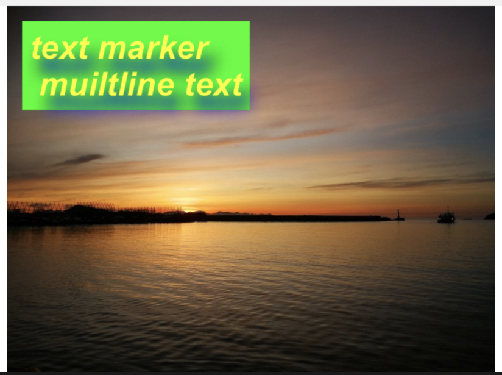

**Example**

<details>
<summary>example code</summary>

```typescript
import Marker, { Position, TextBackgroundType } from "react-native-image-marker"
···
const options = {
  // background image
  backgroundImage: {
    src: require('./images/test.jpg'),
    scale: 1,
  },
  watermarkTexts: [{
    text: 'text marker \n multiline text',
    position: {
      position: Position.topLeft,
    },
    style: {
      color: '#ff00ff',
      fontSize: 30,
      fontName: 'Arial',
      shadowStyle: {
        dx: 10,
        dy: 10,
        radius: 10,
        color: '#008F6D',
      },
      textBackgroundStyle: {
        padding: '10% 10%',
        type: TextBackgroundType.none,
        color: '#0FFF00',
      },
    },
  }],
  scale: 1,
  quality: 100,
  filename: 'test',
  saveFormat: ImageFormat.png,
};
Marker.markText(options);

```

</details>

### Text background stretchX

**API**

[TextBackgroundType.stretchX](https://jimmydaddy.github.io/react-native-image-marker/enums/TextBackgroundType.html#stretchX)

**Sample**

 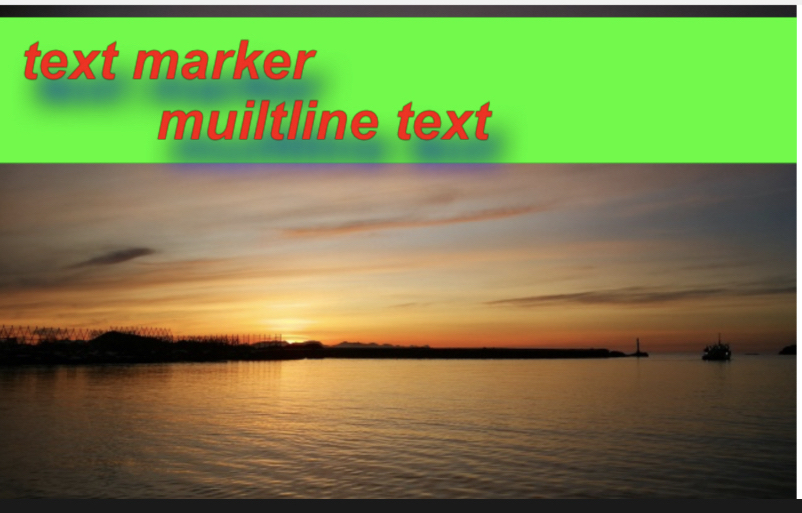

**Example**

<details>
<summary>example code</summary>

```typescript
import Marker, { Position, TextBackgroundType } from "react-native-image-marker"
···
const options = {
  // background image
  backgroundImage: {
    src: require('./images/test.jpg'),
    scale: 1,
  },
  watermarkTexts: [{
    text: 'text marker \n multiline text',
    position: {
      position: Position.topLeft,
    },
    style: {
      color: '#FC0700',
      fontSize: 30,
      fontName: 'Arial',
      shadowStyle: {
        dx: 10,
        dy: 10,
        radius: 10,
        color: '#008F6D',
      },
      textBackgroundStyle: {
        padding: '10% 10%',
        type: TextBackgroundType.stretchX,
        color: '#0FFF00',
      },
    },
  }],
  scale: 1,
  quality: 100,
  filename: 'test',
  saveFormat: ImageFormat.png,
};
Marker.markText(options);
```

</details>

### Text background stretchY

**API**

[TextBackgroundType.stretchY](https://jimmydaddy.github.io/react-native-image-marker/enums/TextBackgroundType.html#stretchY)

**Sample**

 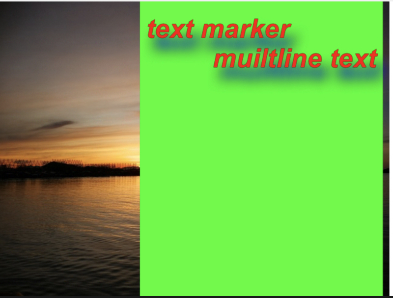

**Example**

<details>
<summary>example code</summary>

```typescript
import Marker, { Position, TextBackgroundType } from "react-native-image-marker"
···
const options = {
  // background image
  backgroundImage: {
    src: require('./images/test.jpg'),
    scale: 1,
  },
  watermarkTexts: [{
    text: 'text marker \n multiline text',
    position: {
      position: Position.topLeft,
    },
    style: {
      color: '#FC0700',
      fontSize: 30,
      fontName: 'Arial',
      shadowStyle: {
        dx: 10,
        dy: 10,
        radius: 10,
        color: '#008F6D',
      },
      textBackgroundStyle: {
        padding: '10% 10%',
        type: TextBackgroundType.stretchY,
        color: '#0FFF00',
      },
    },
  }],
  scale: 1,
  quality: 100,
  filename: 'test',
  saveFormat: ImageFormat.png,
};
ImageMarker.markText(options);

```

</details>

### Text background border radius

**API**

[TextBackgroundType.cornerRadius](https://jimmydaddy.github.io/react-native-image-marker/enums/TextBackgroundType.html#cornerRadius)

**Sample**

 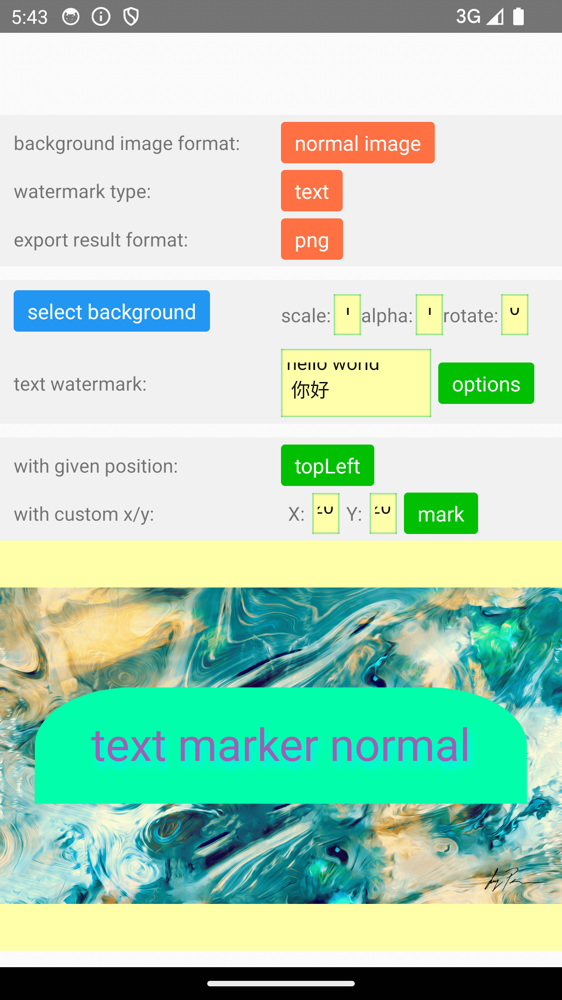

**Example**

<details>
<summary>example code</summary>

```typescript
import Marker, { Position } from "react-native-image-marker"
···
const options = {
  // background image
  backgroundImage: {
    src: require('./images/test.jpg'),
    scale: 1,
  },
  watermarkTexts: [{
    text: 'text marker normal',
    position: {
      position: Position.center,
    },
    style: {
      color: '#FC0700',
      fontSize: 30,
      fontName: 'Arial',
      shadowStyle: {
        dx: 10,
        dy: 10,
        radius: 10,
        color: '#008F6D',
      },
      textBackgroundStyle: {
        padding: '10%',
        color: '#0fA',
        cornerRadius: {
          topLeft: {
            x: '20%',
            y: '50%',
          },
          topRight: {
            x: '20%',
            y: '50%',
          },
        },
      },
    },
  }],
  scale: 1,
  quality: 100,
  filename: 'test',
  saveFormat: ImageFormat.png,
};
ImageMarker.markText(options);

```

</details>

### Text with shadow

**API**

[ShadowLayerStyle](https://jimmydaddy.github.io/react-native-image-marker/interfaces/ShadowLayerStyle.html)

**Sample**

 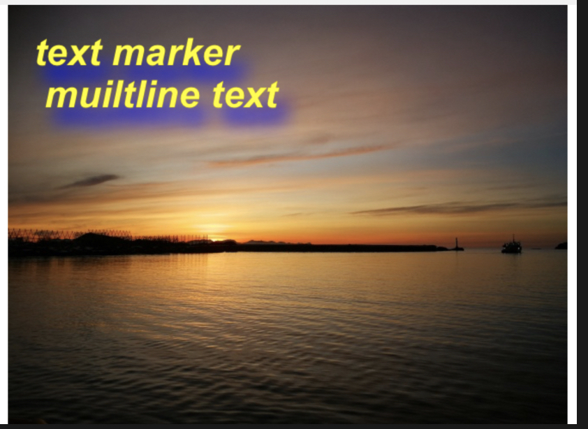

**Example**

<details>
<summary>example code</summary>

```typescript
import Marker, { Position, TextBackgroundType } from "react-native-image-marker"
···
const options = {
  // background image
  backgroundImage: {
    src: require('./images/test.jpg'),
    scale: 1,
  },
  watermarkTexts: [{
    text: 'text marker \n multiline text',
    position: {
      position: Position.topLeft,
    },
    style: {
      color: '#F4F50A',
      fontSize: 30,
      fontName: 'Arial',
      shadowStyle: {
        dx: 10,
        dy: 10,
        radius: 10,
        color: '#6450B0',
      },
    },
  }],
  scale: 1,
  quality: 100,
  filename: 'test',
  saveFormat: ImageFormat.png,
};
Marker.markText(options);

```

</details>

### Multiple text watermarks

**Sample**

 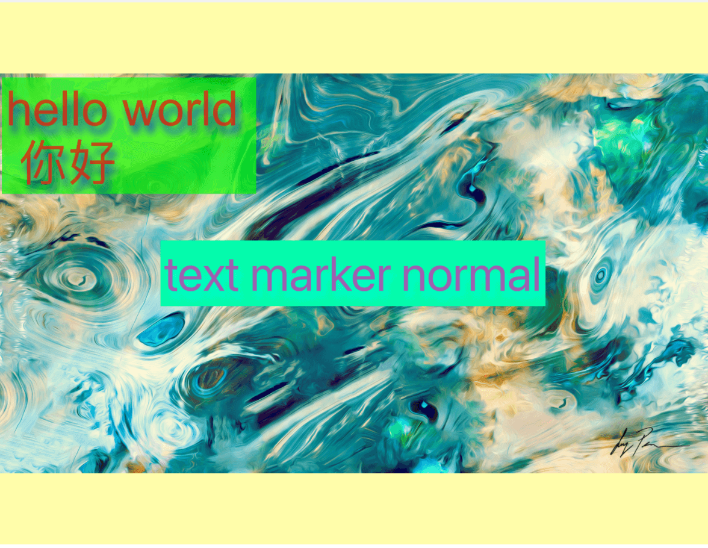

**Example**

<details>
<summary>example code</summary>

```typescript
import Marker, { Position, TextBackgroundType } from "react-native-image-marker"
···
Marker.markText({
  backgroundImage: {
    src: require('./images/test.jpg'),
    scale: 1,
  },
  waterMarkTexts: [{
    text: 'hello world \n 你好',
    position: {
      position: Position.topLeft,
    },
    style: {
      color: '#BB3B20',
      fontSize: 30,
      fontName: 'Arial',
      textBackgroundStyle: {
        padding: '10% 10%',
        color: '#0FFF00',
      },
    },
  }, {
    text: 'text marker normal',
    position: {
      position: Position.topRight,
      X: 60,
      Y: 60,
    },
    style: {
      color: '#6450B0',
      fontSize: 30,
      fontName: 'Arial',
      textBackgroundStyle: {
        padding: '10% 10%',
        color: '#02FBBE',
      },
    },
  }],
})

```

</details>

### Text rotation

**Sample**

<p style="display: flex">
 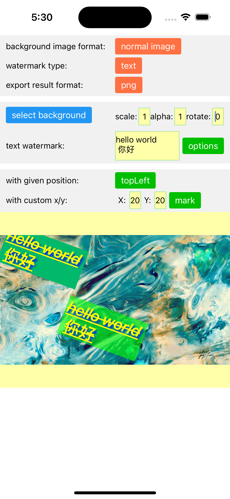
 
 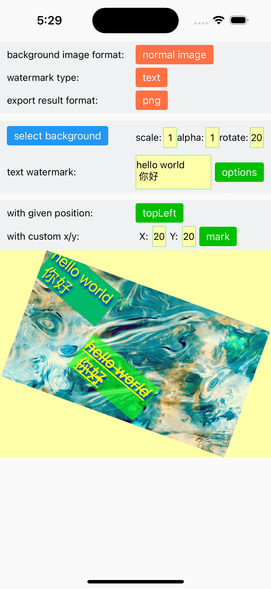
</p>

**Example**

<details>
<summary>example code</summary>

```typescript
import Marker, { Position, TextBackgroundType } from "react-native-image-marker"
···
Marker.markText({
  backgroundImage: {
    src: require('./images/test.jpg'),
    scale: 1,
    rotate: 30,
  },
  waterMarkTexts: [{
    text: 'hello world \n 你好',
    position: {
      position: Position.topLeft,
    },
    style: {
      color: '#FFFF00',
      fontSize: 30,
      fontName: 'Arial',
      rotate: 30,
      textBackgroundStyle: {
        padding: '10% 10%',
        color: '#02B96B',
      },
      strikeThrough: true,
      underline: true,
    },
  }, {
    text: 'text marker normal',
    position: {
      position: Position.center,
    },
    style: {
      color: '#FFFF00',
      fontSize: 30,
      fontName: 'Arial',
      rotate: 30,
      textBackgroundStyle: {
        padding: '10% 10%',
        color: '#0FFF00',
      },
      strikeThrough: true,
      underline: true,
    },
  }],
})

```

</details>

### Icon watermarks

**Sample**

 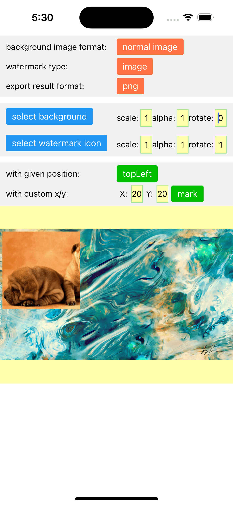

**Example**

<details>
<summary>example code</summary>

```typescript
import Marker, { Position, TextBackgroundType } from "react-native-image-marker"
···
Marker.markImage({
  backgroundImage: {
    src: require('./images/test.jpg'),
    scale: 1,
  },
  watermarkImages: [{
    src: require('./images/watermark.png'),
    position: {
      position: Position.topLeft,
    },
  }],
})

```

</details>

### Multiple icon watermarks

> Note: **_require Android >= N, iOS >= iOS 13_**

**API**

[markImage](https://jimmydaddy.github.io/react-native-image-marker/classes/Marker.html#markImage)

**Sample**

 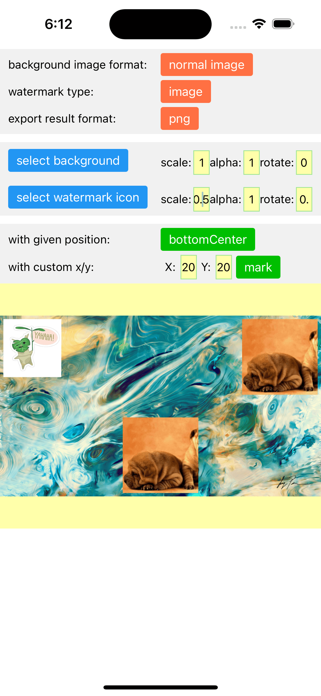

**Example**

<details>
<summary>example code</summary>

```typescript
import Marker, { Position, TextBackgroundType } from "react-native-image-marker"
···
Marker.markImage({
  backgroundImage: {
    src: require('./images/test.jpg'),
    scale: 1,
  },
  watermarkImages: [{
    src: require('./images/watermark.png'),
    position: {
      position: Position.topLeft,
    },
  }, {
    src: require('./images/watermark1.png'),
    position: {
      position: Position.topRight,
      X: 60,
      Y: 60,
    },
  }, {
    src: require('./images/watermark2.png'),
    position: {
      position: Position.bottomCenter,
    },
  }],
})

```

</details>

### Background rotation

**Sample**

<p style="display:flex">
 
 
</p>

**Example**

<details>
<summary>example code</summary>

```typescript
import Marker, { Position, TextBackgroundType } from "react-native-image-marker"
···
Marker.markImage({
  backgroundImage: {
    src: require('./images/test.jpg'),
    scale: 1,
    rotate: 30,
  },
  watermarkImages: [{
    src: require('./images/watermark.png'),
    position: {
      position: Position.topLeft,
    },
  }],
});

Marker.markText({
  backgroundImage: {
    src: require('./images/test.jpg'),
    scale: 1,
    rotate: 30,
  },
  watermarkTexts: [{
    text: 'hello world \n 你好',
    position: {
      position: Position.topLeft,
    },
    style: {
      color: '#FFFF00',
      fontSize: 30,
      fontName: 'Arial',
      rotate: 30,
      textBackgroundStyle: {
        padding: '10% 10%',
        color: '#02B96B',
      },
      shadowStyle: {
        dx: 10,
        dy: 10,
        radius: 10,
        color: '#008F6D',
      },
      strikeThrough: true,
      underline: true,
    },
  }, {
    text: 'hello world \n 你好',
    position: {
      position: Position.center,
    },
    style: {
      color: '#FFFF00',
      fontSize: 30,
      fontName: 'Arial',
      textBackgroundStyle: {
        padding: '10% 10%',
        color: '#0FFF00',
      },
      strikeThrough: true,
      underline: true,
    },
  }],
})

```

</details>

### Icon rotation

**Sample**

 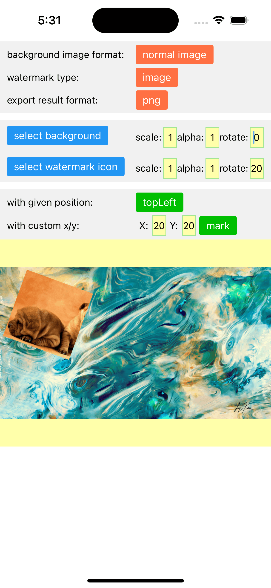

**Example**

<details>
<summary>example code</summary>

```typescript
import Marker, { Position, TextBackgroundType } from "react-native-image-marker"
···
Marker.markImage({
  backgroundImage: {
    src: require('./images/test.jpg'),
    scale: 1,
  },
  watermarkImages: [{
    src: require('./images/watermark.png'),
    position: {
      position: Position.topLeft,
    },
    rotate: 30,
  }],
});
```

</details>

### Transparent background

**Sample**

 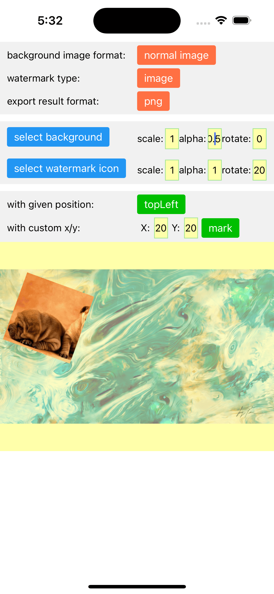

**Example**

<details>
<summary>example code</summary>

```typescript
import Marker, { Position, TextBackgroundType } from "react-native-image-marker"
···
Marker.markImage({
  backgroundImage: {
    src: require('./images/test.jpg'),
    scale: 1,
    alpha: 0.5,
  },
  watermarkImages: [{
    src: require('./images/watermark.png'),
    position: {
      position: Position.topLeft,
    },
  }],
});
```

</details>

### Transparent icon

**Sample**

 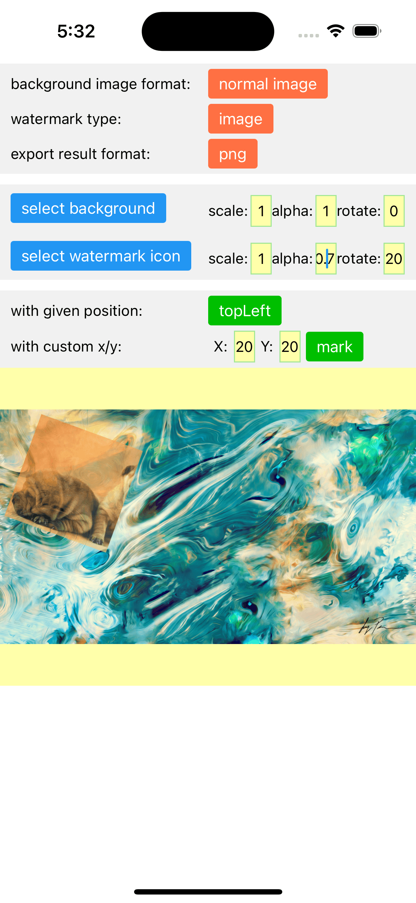

**Example**

<details>
<summary>example code</summary>

```typescript
import Marker, { Position, TextBackgroundType } from "react-native-image-marker"
···
Marker.markImage({
  backgroundImage: {
    src: require('./images/test.jpg'),
    scale: 1,
  },
  watermarkImages: [{
    src: require('./images/watermark.png'),
    position: {
      position: Position.topLeft,
    },
    alpha: 0.5,
  }],
});
```

</details>
